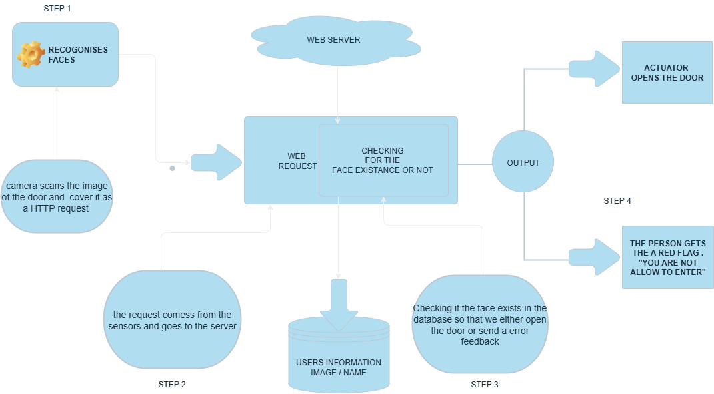

# IoT-door-Opener


This above image is described by the algorithm bellow 

```
if (face == image){
 arduino -> send Opendoor
}else{
 you are not allowed here 
}
```



This diagram above shows the working  circle of the project itself

 - [X] Django is used as a backend server .

 - [X] The frontend by HTML and CSS for design .

 - [X] Postgress is being used as the database  in production and sqlite for devellopment.
 
The server can be acceded on the [Server branch](https://github.com/kithulovali/IoT-door-Opener/tree/server)
